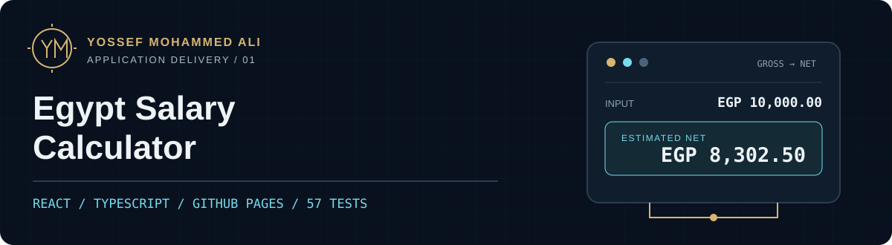

<p align="center">
  
</p>

# Egypt Salary Calculator

An Arabic-first calculator that makes Egyptian gross-to-net and net-to-gross salary estimates understandable. The calculation engine runs in the browser and the React client is delivered statically through GitHub Pages; USD equivalents use a dated reference rate fetched directly from Frankfurter. The optional exchange-rate Function remains available as an explicit override.

**Status: 80 tests passing; deployed to GitHub Pages** · Evidence reviewed **9 September 2026**.

[](https://github.com/yossefseit/egypt-salary-calculator/actions/workflows/ci.yml)
[](https://github.com/yossefseit/egypt-salary-calculator/actions/workflows/deploy-pages.yml)

**[Open on GitHub Pages](https://yossefseit.github.io/egypt-salary-calculator/)** · [Case study](https://yossefseit.github.io/projects/egypt-salary-calculator/) · [Code](https://github.com/yossefseit/egypt-salary-calculator) · [Historical Azure deployment](https://github.com/yossefseit/egypt-salary-calculator/actions/runs/31909528455)

The Pages workflow publishes the production `dist/` bundle under `/egypt-salary-calculator/` after tests, lint and build pass. The production bundle was deployed successfully on **9 September 2026 at 15:25 UTC**, through [Pages run 34370072295](https://github.com/yossefseit/egypt-salary-calculator/actions/runs/34370072295). Live desktop and mobile browser checks confirmed the EGP reference calculation, correct production assets and theme persistence. The retired Azure App Service workflow completed successfully on **15 August 2026 (UTC)**; that run is retained as dated delivery history, not as current hosting evidence. [Evidence and limits →](docs/validation.md)

## The application


[Mobile production preview](docs/assets/pages-application-mobile.png) · Captured locally on 9 September 2026.

| User need | Implemented behavior |
| --- | --- |
| Understand take-home pay | Gross-to-net and net-to-gross modes with itemized tax, employee social insurance and Martyrs Fund deductions. |
| Compare periods | Monthly and annual inputs and summaries, with automatic period conversion. |
| Account for insurance | Automatic insurable-wage limits or a manually entered employee contribution. |
| Use the interface comfortably | Arabic RTL layout, responsive cards, semantic form controls, accessible validation and a persisted light/dark theme. |
| Keep salary inputs local | Salary values remain in React state and the calculation engine. A separate public GET request retrieves a USD/EGP reference rate; it carries no salary amount. |

## Architecture


| Layer | Source of truth |
| --- | --- |
| Interface | React 19, TypeScript and Vite in [`src/App.tsx`](src/App.tsx). |
| Calculation engine | Pure TypeScript rules and bounded binary-search gross-up in [`src/domain/salaryCalculator.ts`](src/domain/salaryCalculator.ts). |
| Reference rate | Browser [`exchangeRate.ts`](src/services/exchangeRate.ts) calls Frankfurter with an eight-second timeout, cancellation and strict pair/rate/date validation. The .NET Function in [`api/`](api/) is an optional override. |
| Quality checks | [`ci.yml`](.github/workflows/ci.yml): locked install → tests → lint → production build. |
| Application delivery | [`deploy-pages.yml`](.github/workflows/deploy-pages.yml): locked install → tests → lint → production build → Pages artifact → GitHub Pages. |

With `VITE_API_BASE_URL` unset, the browser fetches `https://api.frankfurter.dev/v2/rate/USD/EGP` directly using the provider’s public CORS-enabled endpoint. No key, cookies or salary data are sent. The UI shows the source, rate date and indicative nature of the USD equivalent. A provider failure leaves EGP calculations intact and offers a retry. GitHub Pages does not run the optional .NET Function; a separately hosted Function can override the default through `VITE_API_BASE_URL` after its CORS policy is configured.

[Architecture, decisions and learning →](docs/architecture.md)

## Run locally

**Prerequisites:** Git, Node.js **22.x** and npm. The salary calculator works without an Azure account or a running API. An internet connection enables the public reference rate; EGP calculation remains available if that request fails.

```bash
git clone https://github.com/yossefseit/egypt-salary-calculator.git
cd egypt-salary-calculator
npm ci
npm run dev
```

Open the local URL printed by Vite. The repository base path is `/egypt-salary-calculator/`. To inspect a production build:

```bash
npm run build
npm run preview
```

For the optional .NET Function, its environment configuration and local port mapping, see [local API and operations](docs/operations.md).

## Validate

```bash
npm test
npm run lint
npm run build
```

The current source passed **80 tests across three files** on 9 September 2026: 48 calculation tests, 11 interface tests and 21 exchange-rate service tests. The suite covers payroll boundaries, both rate-provider contracts, invalid responses, timeout/cancellation, USD display, provider failure and recovery without salary submission. This supersedes the earlier 57-test suite. The .NET Function also built locally with zero warnings and zero errors; it is not covered by the two JavaScript CI workflows.

This validates the implementation, not an independent certification of payroll accuracy or current public availability. [Reproducible checks and dated results →](docs/validation.md)

## Deploy and operate

The CI workflow validates pull requests to `main`. The GitHub Pages workflow runs on pushes to `main` or manual dispatch, and its deployment guard accepts only `main`. It uses the repository-scoped Pages environment and publishes only `dist/`; no Azure credentials, runtime or paid cloud resource is required. GitHub Pages must be configured once to use **GitHub Actions** as its publishing source.

[Deployment configuration, smoke checks and rollback guidance →](docs/operations.md)

## Calculation references

The engine records a rules effective date of **15 August 2026** and implements progressive tax brackets, high-income bracket exclusions, the EGP 20,000 annual personal exemption, 11% employee insurance, 2026 insurable-wage limits and the Martyrs Fund deduction. The model assumes 12 equal salary months without bonuses or special exemptions.

- [Egyptian Income Tax Law No. 7 of 2024](https://eta.gov.eg/sites/default/files/2024-03/law_no.7-2024.pdf)
- [Egyptian Tax Authority payroll forms](https://eta.gov.eg/ar/payroll-forms)
- [NOSI 2026 insurable-wage limits](https://www.nosi.gov.eg/ar/News/Pages/2025-11-30.aspx)
- [PwC Egypt individual other taxes](https://taxsummaries.pwc.com/egypt/individual/other-taxes), also cited in the engine source
- [Frankfurter API documentation](https://frankfurter.dev/), the browser reference-rate provider, also used by the optional Function

This application provides educational estimates and is not a substitute for professional payroll, tax, or legal advice. Actual payroll may differ because of allowances, bonuses, exemptions, or regulatory changes.

## Documentation map

| Need | Start here |
| --- | --- |
| Understand the system | [Architecture, data flow and decisions](docs/architecture.md) |
| Run or operate it | [Local setup, Pages delivery, smoke checks and rollback](docs/operations.md) |
| Assess the evidence | [Dated tests, deployment record and availability limits](docs/validation.md) |
| Read the implementation | [Interface](src/App.tsx), [salary engine](src/domain/salaryCalculator.ts), [Function](api/GetUsdEgpRate.cs), [workflows](.github/workflows/) |

## Author and attribution

Original application and documentation by Yossef Mohammed Ali. No standalone license file is currently published in this repository. Third-party package terms remain recorded in the dependency manifests.

---

Built by [Yossef Mohammed Ali](https://github.com/yossefseit) · **Cloud Infrastructure & DevOps Engineer** · [Portfolio](https://yossefseit.github.io/) · [Download CV](https://yossefseit.github.io/Yossef_Mohammed_Ali_CV.pdf)
